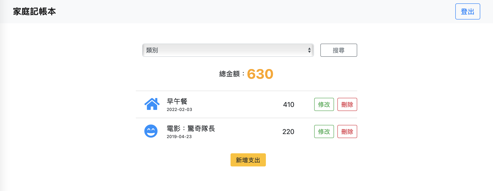

# 我的餐廳清單



## 介紹

記錄自己的花費，可以瀏覽、新增、修改、刪除消費紀錄。

## 功能

- 使用者登入/登出
- 瀏覽所有花費
- 瀏覽特定類別
- 新增一筆花費
- 修改一筆花費
- 刪除一筆花費

## 開始使用

1. 請先確認有安裝 node.js 與 npm
2. 將專案 clone 到本地
3. 在本地開啟之後，透過終端機進入資料夾，輸入：

   ```bash
   npm install
   ```
4. (optional) 安裝完畢後，若需要使用腳本創建種子資料，請輸入：

   ```bash
   npm run seed
   ```

5. 使用腳本，啟動伺服器，請繼續輸入：

   ```bash
   npm run start
   ```

6. 若看見此行訊息則代表順利運行，打開瀏覽器進入到以下網址

   ```bash
   Listening on http://localhost:3000
   ```

7. 若欲暫停使用

   ```bash
   ctrl + c
   ```

## 開發工具

- Node.js 10.15.0
- Express 4.17.2
- Express-Handlebars 6.0.2
- Bootstrap 4.3.1
- Font-awesome 5.8.1
- mongoose 6.1.8
- passport 0.5.2